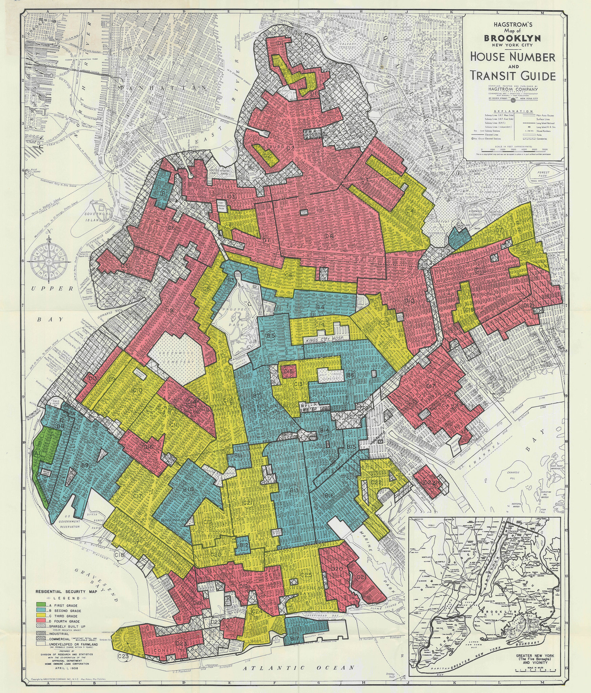

### Introduction:

  

 
Photo from: [NY Times](https://www.nytimes.com/2017/08/24/upshot/how-redlinings-racist-effects-lasted-for-decades.html) 

Redlining, a discriminatory practice that denied resources and opportunities to neighborhoods based on racial and economic factors, has left a lasting impact on cities across the United States. In New York City, the echoes of this policy are still visible today, shaping access to essential services and community health.

This project delves into the relationship between historical redlining and present-day disparities in access to healthy grocery stores and Supplemental Nutrition Assistance Program (SNAP) enrollment. By examining these connections, we aim to shed light on how systemic inequities continue to affect New Yorkers and inspire conversations about solutions for a more equitable future.

### Website Overview:

Our website will cover the following:

- [Meet the Team](team.html)
- [Project Report](report.html) (full description of project)
- Data:
  - [Data sources](about.html)/data cleaning
  - Variable descriptions
- [Descriptive Analysis](demographics.html):
  - Visualizations, such as:
    - Redlining in the Boroughs
    - SNAP total enrollment and demographics
    - Healthy Grocery Stores in NYC
    - Distributions including all three variables
- [Statistical Analysis](statistical_analysis.html)

### Project Overview: Screencast

### Collaborators:

- Sining Leng (sl5454)
- Yan Li(yl5505)
- Pradeeti Mainali (pm3260) 
- Polly Wu(rw3031)
- Shizhe Zhang (sz3214)

We hope this website can be a good source to explore these trends between historical redlining and healthy food access in NYC. If you have any questions, please feel free to contact us.

