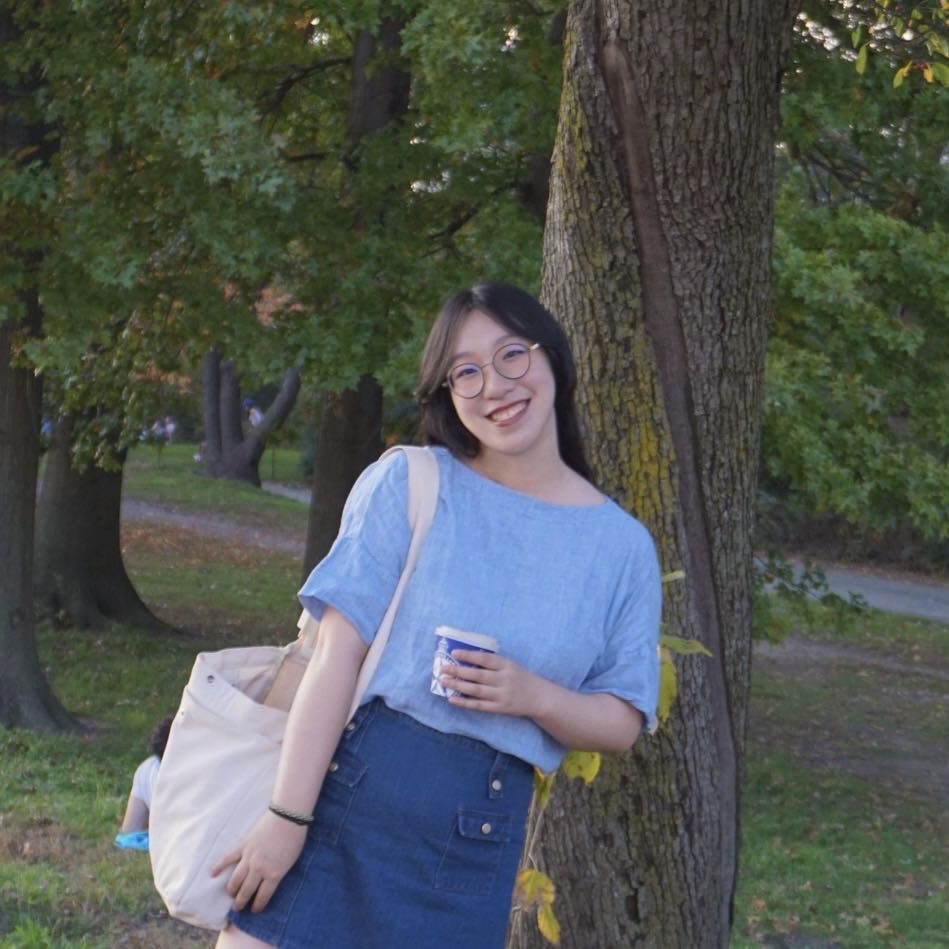

Thank you for visiting our website to learn more about redlining. 

Meet the team below:

#### Sining Leng

#### Yan Li 

#### Pradeeti Mainali

Pradeeti is a second year MPH Epidemiology student. She currently works as a research assistant at NJMS DOMC Infectious Disease. She enjoys watching shows/movies and paining.

#### Polly Wu

Polly is a second year MPH student in the Epidemiology Department. She works as a fellow for the CEESP program and a research assistant for the School of Nursing at Columbia University. She loves crochet and cooking outside of her professional life. 

#### Shizhe Zhang

