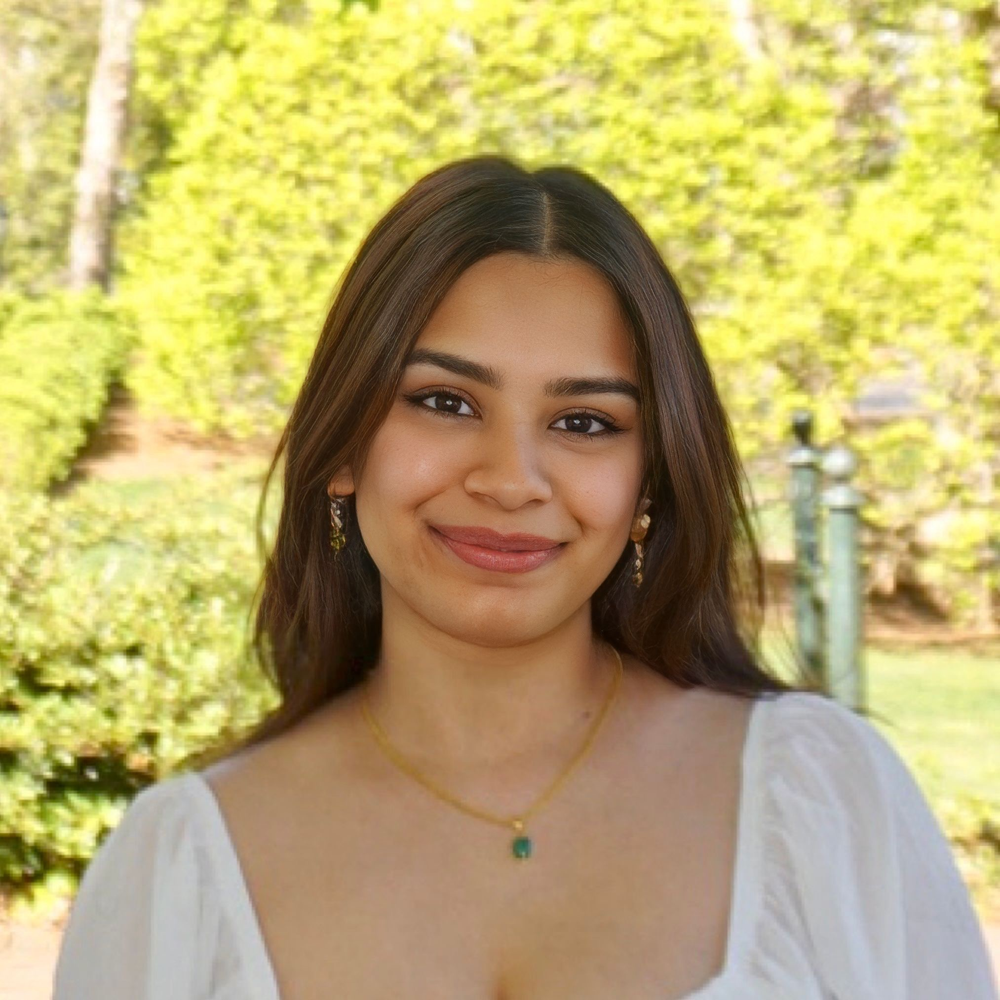

Thank you for visiting our website to learn more about redlining. 

Meet the team below:

#### Sining Leng

Sining is a second-year MPH student in the Biostatistics Department. She works in and is interested in the area of elder justice.

#### Yan Li 

Yan is a second-year MPH student in the Epidemiology Department at Columbia University. She is interested in infectious disease and organ transplant research. She enjoys building Legos and spending time with cats.

#### Pradeeti Mainali

Pradeeti is a second year MPH Epidemiology student. She currently works as a research assistant at NJMS DOMC Infectious Disease. She enjoys watching shows/movies and paining.

#### Polly Wu

Polly is a second year MPH student in the Epidemiology Department. She works as a fellow for the CEESP program and a research assistant for the School of Nursing at Columbia University. She loves crochet and cooking outside of her professional life. 

#### Shizhe Zhang

Shizhe is a second year MPH Biostatistics student. She is currently a research assistant in Biostatistics Department in CUMC. She is a big fun of theaters.
